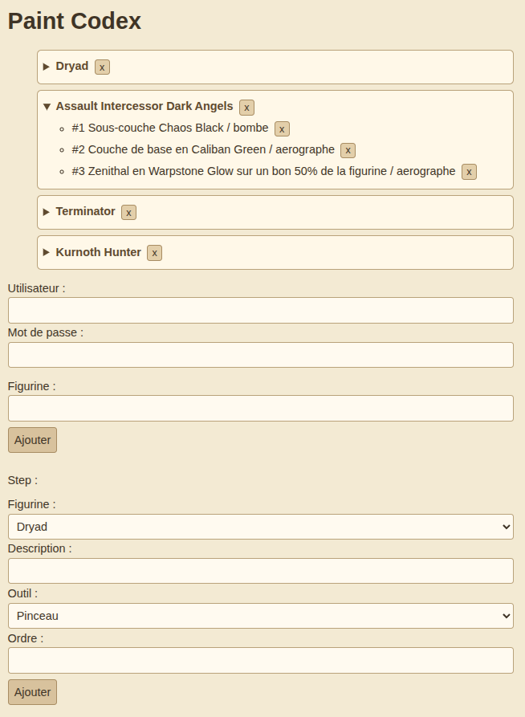

# Paint-Codex

Paint-Codex is a web application designed to help miniature painters take structured notes for their painting projects.

For each miniature, users can record the different painting steps to follow, in order.

The application lets users access these notes from any device with an Internet connection.

## MVP Features

- Create miniatures.
- Add ordered painting steps for each miniature.
- View miniatures and their painting steps from a web interface.
- Access the application from both mobile and desktop devices.
- Protect write operations with authentication.

## Tech Stack

- Python 3.12
- Django
- Django REST Framework
- PostgreSQL hosted on Neon
- HTML / CSS / JavaScript
- Render for deployment

## Architecture

Paint-Codex follows a simple client-server architecture:

- The frontend is a static HTML / CSS / JavaScript application.
- The frontend communicates with the backend through a REST API.
- The backend is built with Django and Django REST Framework.
- Django uses its ORM to read and write data in a PostgreSQL database hosted on Neon.
- The frontend and backend are both deployed on Render.

## Live Demo

[Open Paint-Codex](https://paint-codex-frontend.onrender.com)

## Screenshots

### Desktop

## Future Improvements

Paint-Codex could be extended with features such as:

- Editing miniatures and painting steps.
- Reordering painting steps.
- Organizing a miniature into different painting zones.
- Creating reusable painting recipes.
- Improving authentication and user management.
- Improving the user interface and mobile experience.
